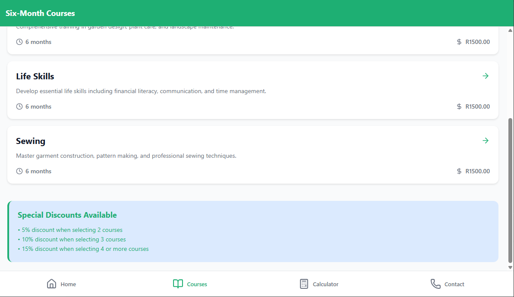

# How It Works: Empowering the Nation - Skills Development & Training App

## Overview

This project is a cross-platform app (mobile & web) built with **React Native**, **Expo**, and **Expo Router**. It helps users discover, calculate, and register for practical skills courses at three venues in Johannesburg. The app is powered by **Supabase** for backend data and uses a unified codebase for Android, iOS, and Web.

---

## Tech Stack

- **React Native**: Mobile UI framework.
- **Expo**: CLI and build tools for React Native, with automatic web support.
- **Expo Router**: File-based navigation for screens and tabs.
- **Supabase**: Cloud database (PostgreSQL), authentication, and instant REST API.
- **TypeScript**: Type safety for all code.
- **Lucide Icons**: Modern SVG icons for React Native.
- **Metro Bundler**: Handles web builds via Expo.

---

## Key Features

1. **Home Screen**  
   - Overview, program info, navigation to all app features.

2. **Courses (Six-Month & Six-Week)**  
   - Browse all courses, see details, fees, duration.
   - Dynamic course detail screens.

3. **Fee Calculator**  
   - Select courses, input contact info, view instant quote.
   - Discounts for multiple courses and VAT calculation.

4. **Contact & Venues**  
   - Venue addresses, emails, phone numbers, business hours.
   - Tap-to-call, mail, or open map navigation.

5. **Unified UI**  
   - Same codebase and screens for mobile and web.
   - Responsive styles for all platforms.

---

## How It Works

### 1. Navigation

- **Expo Router**: Organizes screens in the `/app` folder.
  - `/app/(tabs)/index.tsx`: Home screen.
  - `/app/(tabs)/courses/`: Course list and detail screens.
  - `/app/(tabs)/calculator.tsx`: Fee calculator.
  - `/app/(tabs)/contact.tsx`: Contact info.
- **Tabs**: Main navigation at the bottom, with icons.

### 2. Data Management

- **Supabase**:
  - Tables for `six_month_courses`, `six_week_courses`, and `contact_inquiries`.
  - App fetches courses using Supabase REST API, displayed on course screens.
  - User inquiries (from calculator) are stored in Supabase.

- **Types**: Defined in `lib/supabase.ts` for strong typing and safe data access.

### 3. Fee Calculator Logic

- Users select courses and input contact info.
- The calculator applies discounts:
  - 2 courses: 5% off
  - 3 courses: 10% off
  - 4+ courses: 15% off
- VAT (15%) is added to the discounted total.
- Validation ensures all fields are filled before showing a quote.

### 4. Contact & Venues

- Venues are listed with addresses, maps, emails, and phone numbers.
- Tap actions use React Native’s `Linking` for phone, email, and map navigation.

### 5. Web Support

- **Expo handles web automatically**. Running `npm run dev` starts a web server.
- The app UI is identical on mobile and web.
- Optional `web/index.html` lets you customize browser tab title and meta tags.
- Build for production with `npm run build:web` (output in `web-build/`).

### 6. Database Setup

- **Supabase migrations** (see `/supabase/migrations/`):
  - Create tables for courses and inquiries.
  - Seed sample data for demo use.
  - Row-Level Security (RLS) for public course access and inquiry submission.

---

## Screenshots

# App Screen:

### Home Screen


### Courses List


### Fee Calculator


### Contact & Venues


# Laptop Screen:
### Home Screen


### Courses List


### Fee Calculator


### Contact & Venues


## How to Run Locally

1. Clone the repo:
   ```bash
   git clone https://github.com/ST10489659/XHAW---POE-Project.git
   cd XHAW---POE-Project
   ```

2. Install dependencies:
   ```bash
   npm install
   ```

3. Start the development server:
   ```bash
   npm run dev
   ```
   - Scan the QR code for mobile, or open the web link in your browser.

4. Build for web:
   ```bash
   npm run build:web
   ```
   - Deploy the `web-build/` folder to Netlify, Vercel, or any static host.

---

## File Structure

- `/app/`: All screens and navigation.
- `/lib/supabase.ts`: Supabase client and types.
- `/supabase/migrations/`: SQL for database setup.
- `/assets/images/`: Icons and favicons.
- `/web/index.html`: (Optional) Custom page for web meta.

---

## Customization & Deployment

- **Change colors, icons, or content:** Edit files in `/app/`.
- **Add courses or venues:** Update Supabase tables.
- **Deploy web:** Use Expo’s static site output.

---

## Credits

Developed by [ST10489659](https://github.com/ST10489659).  
See [README.md](README.md) for more info.

---

## Questions?

Open an issue on GitHub or contact via the app’s Contact tab!