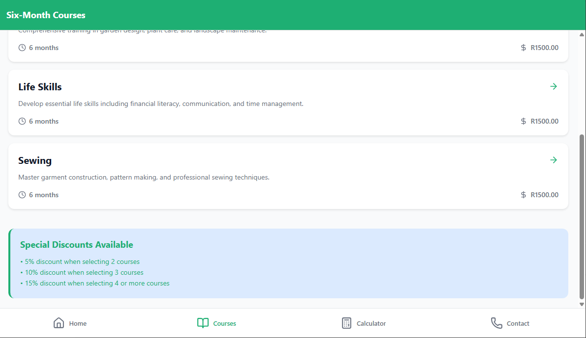

# Empowering the Nation - Skills Development & Training

Welcome to Empowering the Nation! 
This app provides comprehensive training programs designed to equip individuals with practical skills for personal and professional development. Courses are taught by experienced instructors at three convenient locations across Johannesburg.

## Table of Contents
- [Overview](#overview)
- [Features](#features)
- [Installation](#installation)
- [Usage](#usage)
- [Contact](#contact)
- [License](#license)
- [Screenshot](#Screenshot)

## Overview
Empowering the Nation offers:
- Six-month professional training courses
- Six-week skill development programs
- Hands-on training and certification upon completion
- Locations: Sandton, Rosebank, Randburg
- The app supports both mobile and web platforms through Expo, allowing learners to access training materials and registration forms easily.
- The platform emphasizes career advancement, practical experience, and affordable learning through a discount model for multiple enrollments.
- Designed to be used by both employees and independent learners seeking to upskill.

## Features
- Course browsing (six-month and six-week programs)
- Detailed course descriptions, fees, and durations
- Fee calculator (with discounts for multiple courses)
- Contact and venue details, business hours
- Registration and inquiry via contact form
- User-Friendly Interface: Simple, responsive UI designed for easy navigation.
- Cross-Platform Support: Works on Android, iOS and Web.
- Discount Tracker: Tracks user enrollments and calculates percentage discounts dynamically.

## Installation
1. Clone the repository:
   ```bash
   git clone https://github.com/ST10489659/XHAW---POE-Project.git
   ```
2. Install dependencies:
   ```bash
   npm install
   ```
3. Run the app with Expo:
   ```bash
   npm run dev
   ```

## Website / Web App
This project supports web deployment via Expo. After running `npm run dev`, access the local web server provided by Expo. For production, export the web build with:
```bash
npm run build:web
```
The web version can be published via Expo or deployed to a static hosting platform.

## Usage
- Browse courses via the Courses tab
- Use the Fee Calculator tab to estimate costs and discounts
- Contact campuses from the Contact tab for inquiries or registration

## Contact
- Sandton Campus: sandton@empoweringthenation.co.za, 011 234 5678
- Rosebank Campus: rosebank@empoweringthenation.co.za, 011 345 6789
- Randburg Campus: randburg@empoweringthenation.co.za, 011 456 7890
- General: info@empoweringthenation.co.za, 011 123 4567

## License
This project is licensed under the MIT License.

---

### Code Reference
Most navigation and functionality are handled via `expo-router` and React Native components. For details, see:
- [app/(tabs)/index.tsx](app/(tabs)/index.tsx): Main home and navigation
- [app/(tabs)/courses/*](app/(tabs)/courses/): Course listings and details
- [app/(tabs)/calculator.tsx](app/(tabs)/calculator.tsx): Fee calculator logic
- [app/(tabs)/contact.tsx](app/(tabs)/contact.tsx): Contact and venue details

For further details, please refer to the source code in the respective files.
## Screenshots

# App Screen:

### Home Screen
![Home Screen]

### Courses List
![Courses List]

### Fee Calculator
![Fee Calculator]

### Contact & Venues
![Contact & Venues]


# Laptop Screen:
### Home Screen
![Home Screen]

### Courses List
![Courses List]

### Fee Calculator
![Fee Calculator]


### Contact & Venues
![Contact & Venues]


